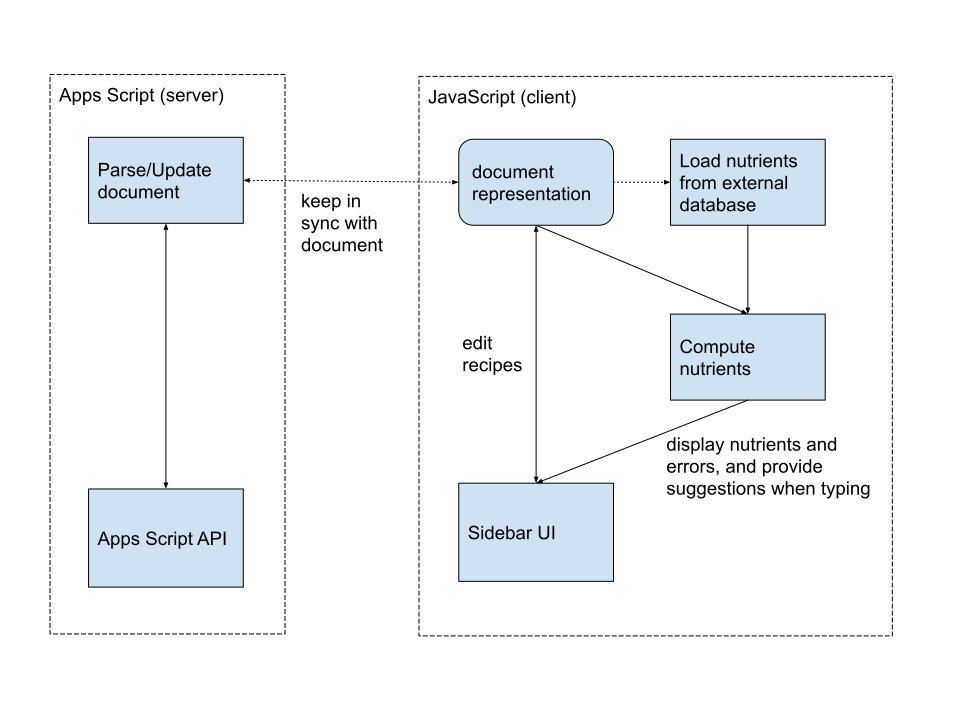

# Recipe Analyzer

This repository contains a typescript library for computing nutritional data
for recipes contained in a Google Doc.  It contains Google Apps Script code
(written in TypeScript) as well as code for analyzing nutritional data that is
not specific to Apps Script .

This is not an officially supported Google product

## High Level Design

(not yet implemented)

This code defines a Add-on for Google Docs, which
 * Parses recipes defined in a Google Docs document
 * Computes nutrients for these recipes
 * Provides a UI to easily edit recipes

This design allows the benefits of keeping all data in a Google
doc, while extending the doc by allowing automatic computation of nutritional
information, and also providing a UI that simplifies editing of recipes.

## Implementation

The architecture of the docs add-on is shown below

The code has the following components
 * Apps Script code to parser recipes from the Google Doc and update it.
 * A TypeScript wrapper around this (run in client-side UI code) that keeps
   a local copy of the parsed recipe data, and keeps this in sync with the Google
   doc.
 * TypeScript client-side code that provides a GUI for editing the recipes and
   computing nutrient values.

## Roadmap

The following are possible extensions/improvments

 * Allow editing ingredient in-place instead of using a separate form.  This would
   require using the contentEditable property since we have HTML links.
 * This might also involve switching from a table to a list in the document itself.
 * Use context-sensitive menu for add/delete/move ingredients.
 * Support drag-and-drop for moving ingredients.
 * UI for user/document level configuration.
 * Use and interface for OpenFoodFacts and FDC wrappers, and possibly unify this with
   recipe-related functionality.
 * Find a way to follow the cursor in the document
 * Add more unit tests
 * Maybe stop using the action-reducer pattern on the server-side so we don't have to
   share AppsScript and JS code.  Instead, use multiple server-side functions, possibly
   expanding the client- and server-side wrappers to make it even simpler to wrap
   and mock server-side functions.